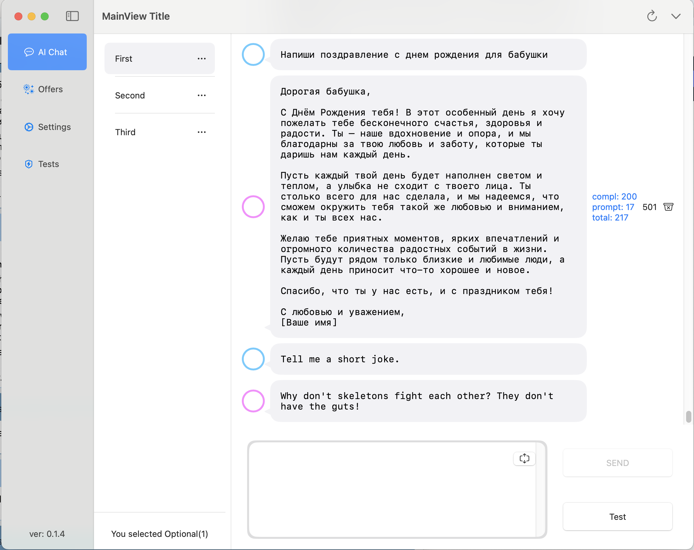

## App for some experiments

This is a lightweight macOS app designed to test a Swift community-maintained implementation of the OpenAI public API. 
It features a simple, tabbed interface where users can interact with AI chat, explore generated responses, and run custom test prompts.

The app supports both standard and streaming chat API, allowing real-time interaction for a smoother and more dynamic user experience. 

### Note
Don't worry all secrets have been changed
